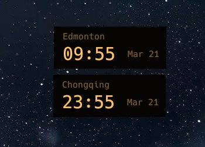
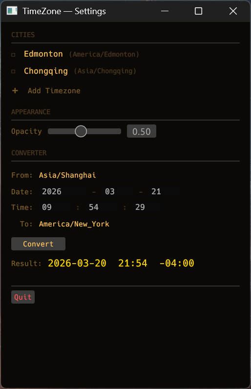

# H-TimeZone

A minimal always-on-top world clock HUD for the desktop. Built in Rust + egui.




## What it does

Displays multiple world clocks as small floating cards on your desktop — always visible, always on top, never in your way. Each card shows the city name, current time, and date at a glance. Cards can be freely positioned anywhere on screen and their positions are remembered across restarts.

Double-click any card to open Settings, where you can manage cities, adjust opacity, and convert times between timezones.

## Features

- **Multi-card layout** — one independent floating window per timezone, freely positionable
- **Always-on-top** — stays visible over other windows; no taskbar entry (ambient overlay only)
- **System tray** — right-click tray icon for Settings / Quit; no dock or taskbar clutter
- **Timezone converter** — convert a specific date/time from one timezone to another
- **Opacity control** — adjustable from 10% to 100% (default 70%)
- **Position memory** — each card remembers its last position on screen
- **Fuzzy city search** — type to filter from the full IANA timezone database when adding cities

## Aesthetic

Retro-futuristic terminal style — phosphor amber on near-black, like a 1980s aviation flight computer. Monospace everywhere. Semi-transparent so your wallpaper shows through.

```
┌──────────────────┐  ┌──────────────────┐  ┌─────────────────┐
│ Shanghai  Mar 21 │  │ New York  Mar 21 │  │ Tokyo    Mar 22 │
│ 14:30            │  │ 02:30            │  │ 16:30           │
└──────────────────┘  └──────────────────┘  └─────────────────┘
```

## Installation

Download the latest release from [Releases](../../releases) and run the `.exe` directly — no installer needed.

**Requirements:** Windows 10/11 (64-bit)

## Building from source

```bash
# Prerequisites: Rust toolchain (https://rustup.rs)
git clone https://github.com/Bert2048/H-TimeZone.git
cd H-TimeZone
cargo build --release
# Binary: target/release/timezone-tool.exe
```

## Usage

- **Drag** any card to reposition it
- **Double-click** any card to open Settings
- **System tray** (right-click) → Settings / Quit
- In Settings → **Cities**: add or remove timezones
- In Settings → **Appearance**: adjust window opacity
- In Settings → **Converter**: convert a specific time between any two timezones

## Config

Settings are stored at:
```
C:\Users\<user>\AppData\Roaming\timezone-tool\config.toml
```

Default clocks: Shanghai, New York, London, Edmonton, Los Angeles, Tokyo.

## Tech stack

- [Rust](https://www.rust-lang.org/) — systems language
- [egui](https://github.com/emilk/egui) / [eframe](https://github.com/emilk/egui/tree/master/crates/eframe) 0.31 — immediate-mode GUI
- [chrono](https://github.com/chronotope/chrono) + [chrono-tz](https://github.com/chronotope/chrono-tz) — timezone-aware time handling
- [tray-icon](https://github.com/tauri-apps/tray-icon) — system tray integration

## License

MIT
